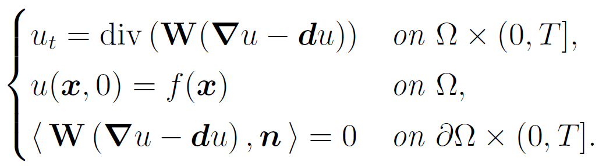
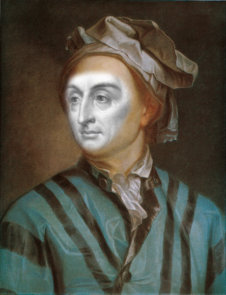
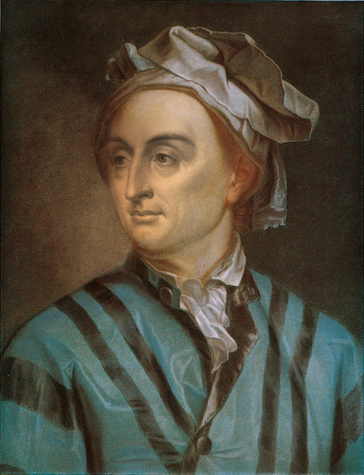
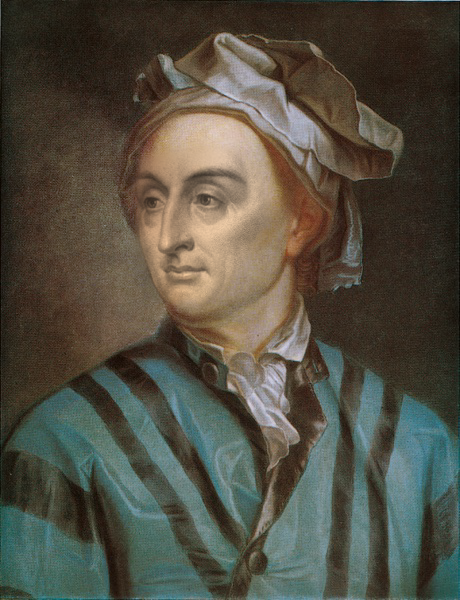
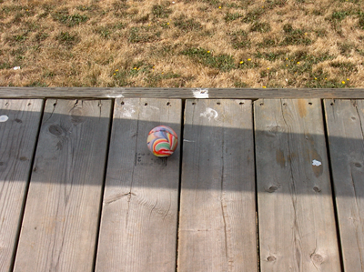
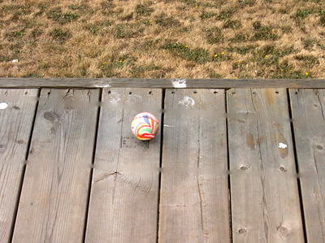
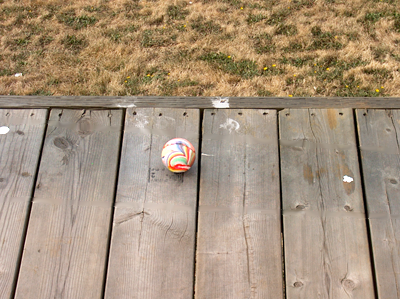
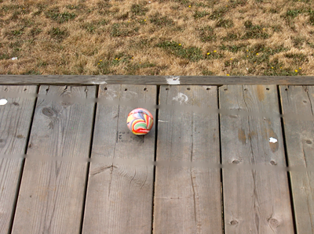

# Osmosis_Filtering_using_ADI_and_OS
This repository contains a Matlab implementation of the osmosis filtering for shadow removal and seamless cloning

## Introduction

The anisotropic osmosis filtering is a drift-diffusion partial differential equation written as:
<p align="left">
  
</p>

where **d** is the vector drift field. For isotropic diffusion, **W** is set to an identity matrix. A detailed explanation of the model can be found in [[1]](#1) to [[4]](#4).

In this project, we implemented a solver for the osmosis model based on the Alternating Direction Implicit (ADI) method and the Operator Splitting (OS) method. The applications include shadow removal and seamless cloning. 

## Seamless Cloning

```
solve_imageFusion.m
```

Set *local* to *true* to apply Dirichlet boundary condition outside the ROI; otherwise, the osmosis will be solved globally.

The local and global osmosis filtering models are described in [[5]](#5).

> ### Results
Input | Result (local) | Result (global):
<p align="left">
  
  
  
</p>

## Shadow Removal

```
solve_shadowRemoval.m
```
Set *local* to *true* to apply Dirichlet boundary condition outside the ROI; otherwise, the osmosis will be solved globally. 

Set *anisotrpic_diffusion* to *true* to apply anisotropic diffusion on shadow boundary, which can preserve details inside the boundary. 

For anisotropic diffusion, the Peachman-Rachford ADI scheme is not applicable since the problem contains mixed derivative term.

> ### Results
Input:
<p align="left">
  
</p>

Result (isotropic+local) | Result (anisotropic+local):
<p align="left">
  
  
</p>


Result (isotropic+global) | Result (anisotropic+global):
<p align="left">
  
  
</p>


## References
<a id="1">[1]</a> Weickert, Joachim, et al. "Linear osmosis models for visual computing." International Workshop on Energy Minimization Methods in Computer Vision and Pattern Recognition. Springer, Berlin, Heidelberg, 2013.

<a id="2">[2]</a> Vogel, Oliver, et al. "A fully discrete theory for linear osmosis filtering." International Conference on Scale Space and Variational Methods in Computer Vision. Springer, Berlin, Heidelberg, 2013.

<a id="3">[3]</a> Calatroni, Luca, et al. "Alternating direction implicit (ADI) schemes for a PDE-based image osmosis model." Journal of Physics: Conference Series. Vol. 904. No. 1. 2017.

<a id="4">[4]</a> Parisotto, Simone, et al. "Anisotropic osmosis filtering for shadow removal in images." Inverse Problems 35.5 (2019): 054001.

<a id="5">[5]</a> d'Autume, Marie, Jean-Michel Morel, and Enric Meinhardt-Llopis. "A flexible solution to the osmosis equation for seamless cloning and shadow removal." 2018 25th IEEE International Conference on Image Processing (ICIP). IEEE, 2018.

